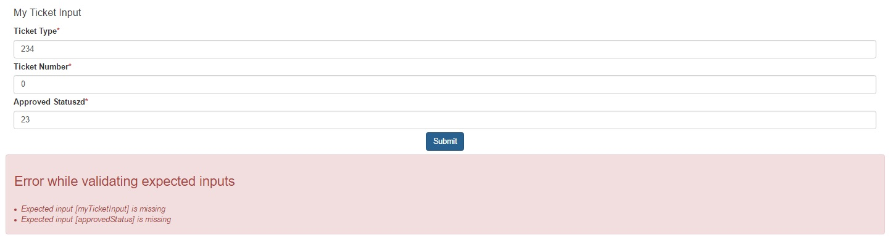

# widget_displayfailedresponse
This widget is use to display the error come from the Submit.

* create a new JSON (for example, myFailedResponseValue)
* on the submit, match the "Failed response value" propertie to this JSON variable myFailedResponseValue
* on the new widget, match the property "Failed Response Value" the variable myFailedResponseValue

That's it !
If you have an error on the submit, you will see that :

